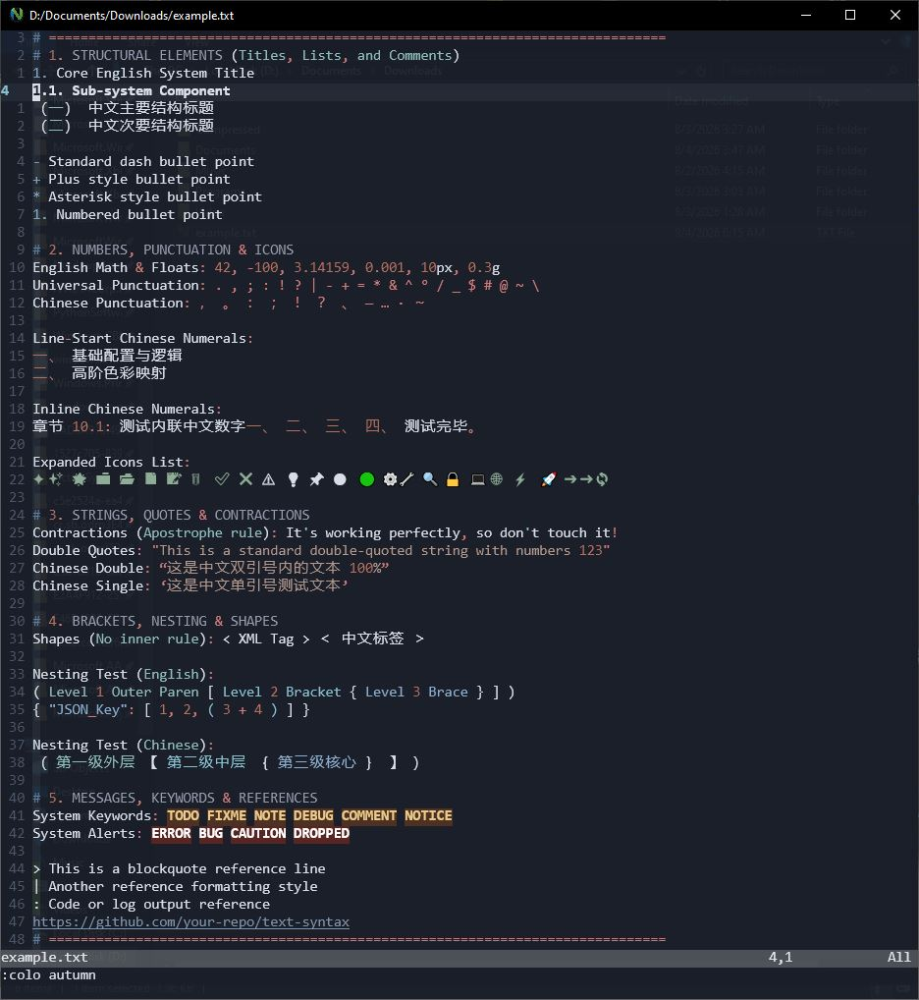
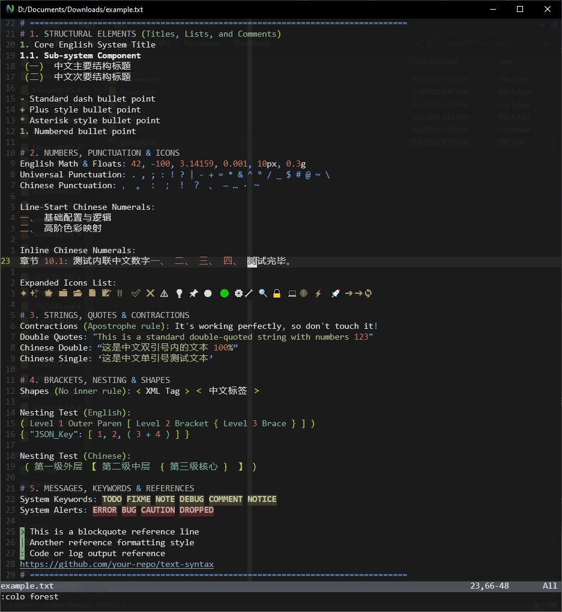
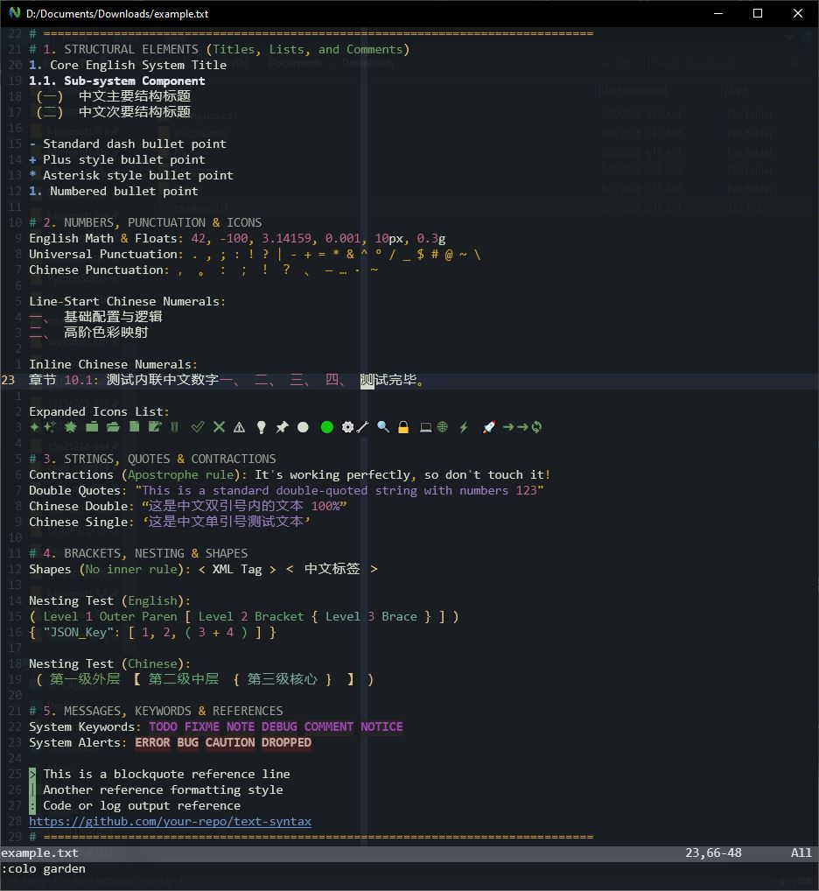

# text-syntax

A beautiful syntax highlighting for plain text (`.txt`) files in **Vim** and **Neovim**.
---
## Screenshots
| autumn theme | forest theme | garden theme |
|:---:|:---:|:---:|
|  |  |  |
---

## Installation

### 1. Using lazy.nvim (Recommended)

Open your Neovim configuration file (usually `~/.config/nvim/lua/plugins.lua` or your main plugin file) and **add the following code** inside your plugin list:

```lua
{
  "vnzo/text-syntax",
}
```

**Example** of how the full section should look:

```lua
require("lazy").setup({
  -- other plugins...

  {
    "vnzo/text-syntax",
  },
})
```

Then restart Neovim or run `:Lazy sync`.

---

### 2. Using vim-plug

Add this line to your `~/.vimrc` or `init.vim`:

```vim
Plug 'vnzo/text-syntax'
```

Then open Vim/Neovim and run:

```vim
:PlugInstall
```
---

### 3. Manual Installation

If you don’t use a plugin manager, clone the repository into the correct folder.

**Linux / macOS (Neovim):**

```bash
git clone https://github.com/vnzo/text-syntax.git ~/.local/share/nvim/site/pack/plugins/start/text-syntax
```

**Linux / macOS (Vim):**

```bash
git clone https://github.com/vnzo/text-syntax.git ~/.vim/pack/plugins/start/text-syntax
```

**Windows (Neovim):**

Clone the repository into this folder:

```
%LOCALAPPDATA%\nvim-data\site\pack\plugins\start\text-syntax\
```

After cloning, restart Vim or Neovim.

---

## How to Use

1. Open any `.txt` file.  
   The syntax highlighting should activate automatically.

2. You can use one of the included colorschemes i made:

```vim
:colo autumn
:colo forest
:colo garden
```
---
## Debug

If the txt file doesn't show the syntax color, use ":set ft?" to see if your file type is set to text.

---
